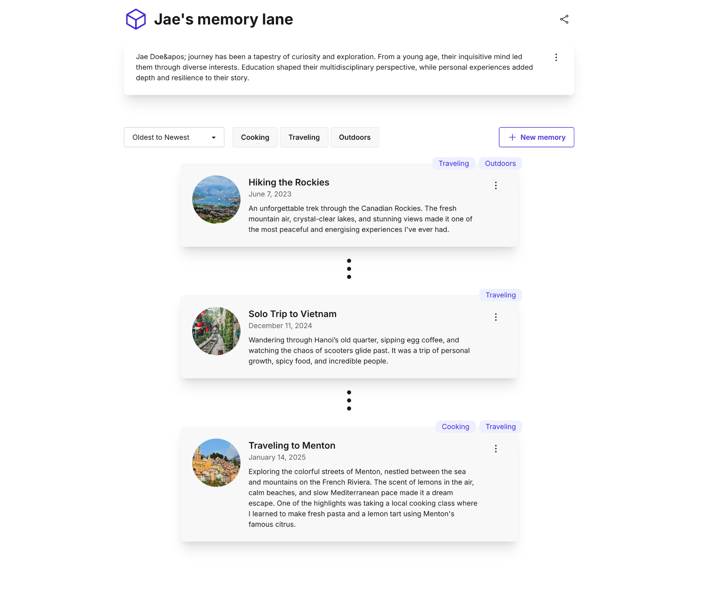

# Memory Lane

Memory Lane is a web application that allows you to capture, organize, and revisit your important moments. This application enables you to store and manage your memories in a single place with a clean, intuitive interface.

## Features

- **Create Memories**: Save important moments with titles, descriptions, timestamps, and images
- **Memory Management**: View, edit, and delete your stored memories
- **Description Support**: Add detailed descriptions to provide context for your memories
- **Tagging System**: Organize memories with tags (cooking, traveling, outdoors)
- **Filtering**: Filter memories by tags to find specific moments quickly
- **Sorting**: Sort memories by newest or oldest first
- **Responsive Design**: Works seamlessly on both desktop and mobile devices

## Setup Instructions

### Prerequisites

- Node.js (v14 or higher)
- npm or yarn

### Installation

1. Clone the repository
2. Install dependencies:
   ```
   npm install
   ```
3. Set up environment variables:
   - Create a `.env.local` file in the root directory
   - Copy the contents from `.env.example` into `.env.local`
   - The default configuration should look like:
     ```
     NEXT_PUBLIC_API_URL=http://localhost:4001
     ```

### Running the Application

#### Start the Backend API

```
npm run serve:api
```

The API server will run on port 4001.

#### Start the Frontend Development Server

In a separate terminal:

```
npm run dev
```

The frontend application will be available at http://localhost:3000

### Running Tests

#### End-to-End Tests

1. Start the backend API in one terminal:
   ```
   npm run serve:api
   ```

2. Run the tests in another terminal:
   ```
   npm run test:e2e
   ```

Additional test commands:
- Run tests with UI: `npm run test:e2e:ui`
- Run tests in debug mode: `npm run test:e2e:debug`

## Tech Stack

- **Frontend**: Next.js, React, Tailwind CSS, DaisyUI
- **Backend**: Express.js, SQLite
- **Testing**: Playwright
- **Form Validation**: React Hook Form, Zod

## Project Structure

- `/src`: Frontend application code
  - `/app`: Next.js app directory
  - `/components`: React components
  - `/schemas`: Zod schemas for validation
  - `/types`: TypeScript type definitions
- `/tests`: Test files
  - `/playwright`: End-to-end tests
- `api.js`: Backend API server

## Application Preview


